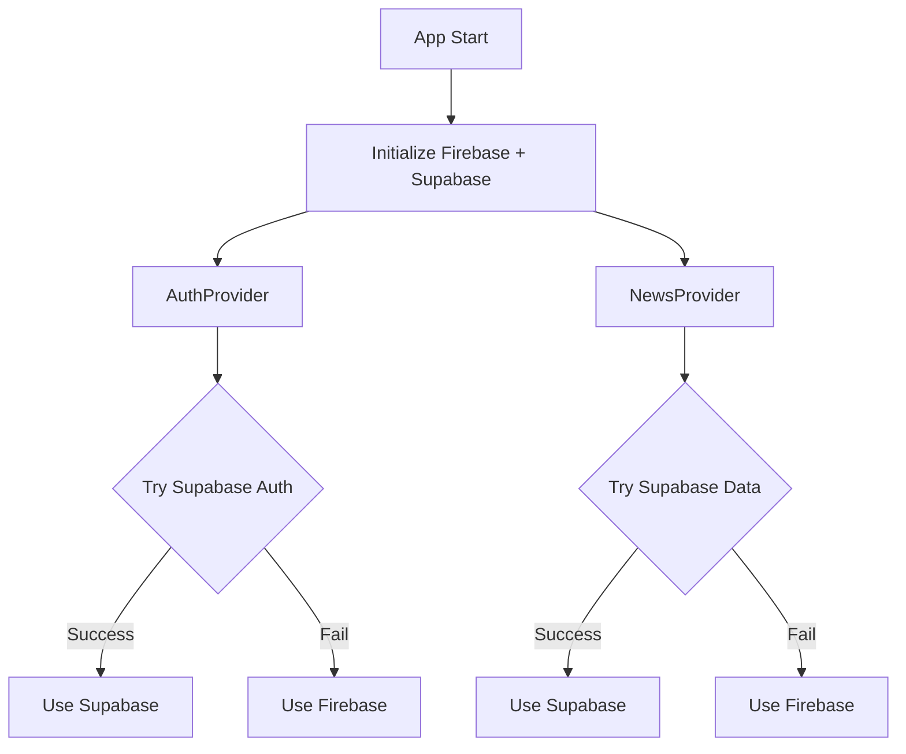

# Supabase Migration Testing Guide

## Overview

This guide outlines how to test the parallel Firebase + Supabase functionality in the samachar-plus-ott-app Flutter project to ensure no breaking changes.

## Prerequisites

1. **Flutter SDK** (v3.0 or higher)
2. **Supabase Project Setup**
   - URL: `https://yrmfnwouyzxteswiocmg.supabase.co`
   - Anon Key: Set in `.env` file
   - Cloudflare R2: Configured in environment

## Setup Instructions

### 1. Install Dependencies

```bash
# Generate environment files
flutter pub get
dart run build_runner build

# Verify no compilation errors
flutter analyze
```

### 2. Configure Environment Variables

Update your `.env` file with actual credentials:

```bash
# .env
SUPABASE_URL=https://yrmfnwouyzxteswiocmg.supabase.co
SUPABASE_ANON_KEY=your_actual_anon_key_here
R2_ENDPOINT=your_actual_r2_endpoint_here
R2_BUCKET_NAME=your_actual_bucket_name_here
ENVIRONMENT=development
```

## Testing the Migration

### 1. Authentication Provider Testing

**Test Scenario 1: Supabase Authentication (Preferred)**
- The app will attempt Supabase authentication first
- If credentials exist in Supabase, use Supabase
- Fallback to Firebase if Supabase fails

**Test Scenario 2: Firebase Fallback**
- Test with credentials only in Firebase
- Verify automatic fallback works

**Test Scenario 3: Dual Provider Test**
- Create same user in both Firebase and Supabase
- Verify Supabase takes precedence

```dart
// In your app, check which provider is active:
AuthProvider authProvider = Provider.of<AuthProvider>(context);
print('Active provider: ${authProvider.activeProvider}');
print('Is authenticated: ${authProvider.isAuthenticated}');
print('User: ${authProvider.user}');
```

### 2. News Provider Testing

**Test Scenario 1: Supabase News Data (Preferred)**
- App attempts to load from Supabase first
- If data exists, use Supabase data

**Test Scenario 2: Firebase Fallback**
- If Supabase fails, automatically falls back to Firebase
- Verify data loads correctly

**Test Scenario 3: Force Provider Testing**
The app includes helper methods for testing:

```dart
NewsProvider newsProvider = Provider.of<NewsProvider>(context);

// Force load from Supabase
newsProvider.forceLoadFromSupabase();

// Force load from Firebase
newsProvider.forceLoadFromFirebase();
```

### 3. Data Model Compatibility

**Test Scenario: Cross-Provider Data**
- Create user profile in Firebase
- Verify it can be read in Supabase format
- Create news article in Supabase
- Verify it can be read in Firebase format

The updated data models handle both formats automatically:

```dart
// UserModel handles both formats
UserModel user = UserModel.fromJson(firebaseData); // Firebase format
UserModel user2 = UserModel.fromJson(supabaseData); // Supabase format

// NewsArticle handles both formats
NewsArticle article = NewsArticle.fromJson(firebaseData); // Firebase format
NewsArticle article2 = NewsArticle.fromJson(supabaseData); // Supabase format
```

### 4. UI Flow Testing

**No Breaking Changes Expected:**
- All existing UI screens remain unchanged
- Authentication flow works the same way
- News browsing functionality remains identical
- Navigation routes unchanged

**Test Screens:**
1. Splash Screen - Should load normally
2. Authentication - Login/signup should work
3. Home Screen - News feed should display
4. Categories - Should filter correctly
5. Live TV - Should stream properly

## Migration Architecture

### Dual Provider Strategy



### Key Features

1. **Automatic Fallback**: Always tries Supabase first, falls back to Firebase
2. **Data Compatibility**: Models handle both Firebase and Supabase formats
3. **No UI Changes**: All existing screens work unchanged
4. **Seamless Migration**: Users won't notice the backend switch

## Environment Configuration

### Development
```bash
ENVIRONMENT=development
# Enables detailed logging and debugging
```

### Production
```bash
ENVIRONMENT=production
# Enables optimized settings
```

## Troubleshooting

### Common Issues

1. **Supabase Initialization Error**
   - Check Supabase URL and anon key in `.env`
   - Verify environment file is in project root

2. **Authentication Failures**
   - Check if user exists in the expected provider
   - Verify database schema matches expected format

3. **Data Loading Issues**
   - Check collection names: `articles`, `channels`, `user_profiles`
   - Verify field names match expected format

4. **Compilation Errors**
   - Run `flutter clean && flutter pub get`
   - Regenerate environment files: `dart run build_runner build`

### Debug Mode

Enable detailed logging by checking `ENVIRONMENT=development`:

```dart
// In auth_provider.dart
bool _isSupabaseConfigured() {
  return Env.environment == 'development' || Env.supabaseAnonKey.isNotEmpty;
}
```

## Migration Checklist

- [ ] Flutter app compiles without errors
- [ ] Environment variables configured
- [ ] Supabase project accessible
- [ ] Authentication works on both providers
- [ ] News data loads from both sources
- [ ] UI flows unchanged
- [ ] No breaking changes detected
- [ ] Performance acceptable with dual providers

## Next Steps

After successful testing:

1. **Monitor Performance**: Check app startup time and data loading
2. **User Testing**: Ensure real users experience no issues
3. **Gradual Migration**: Slowly migrate data from Firebase to Supabase
4. **Cleanup Phase**: Remove Firebase code when ready

## Support

For issues during testing:
1. Check Flutter logs: `flutter logs`
2. Enable debug mode in environment
3. Verify Supabase connection and data
4. Test with sample data in both providers